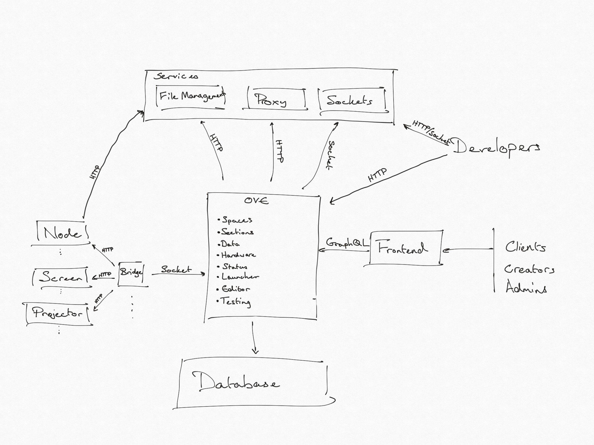
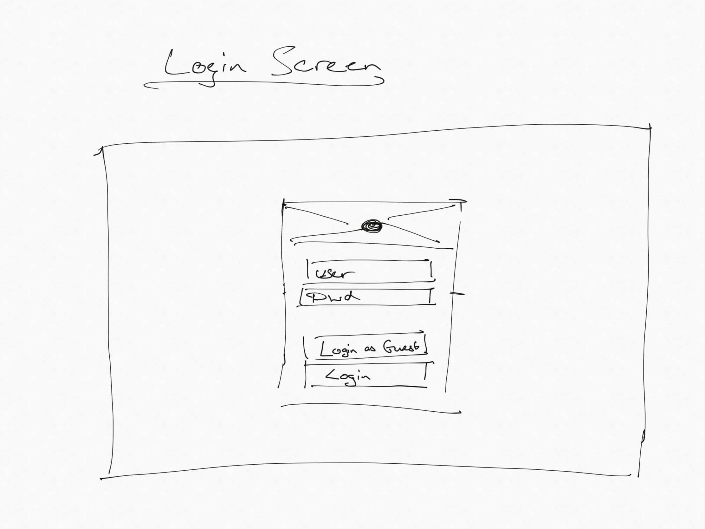
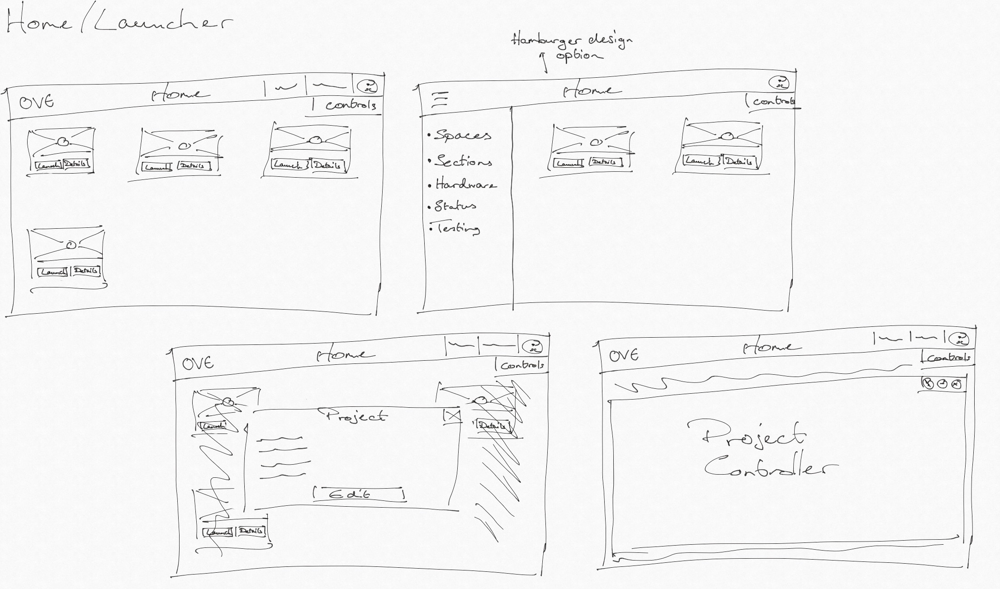
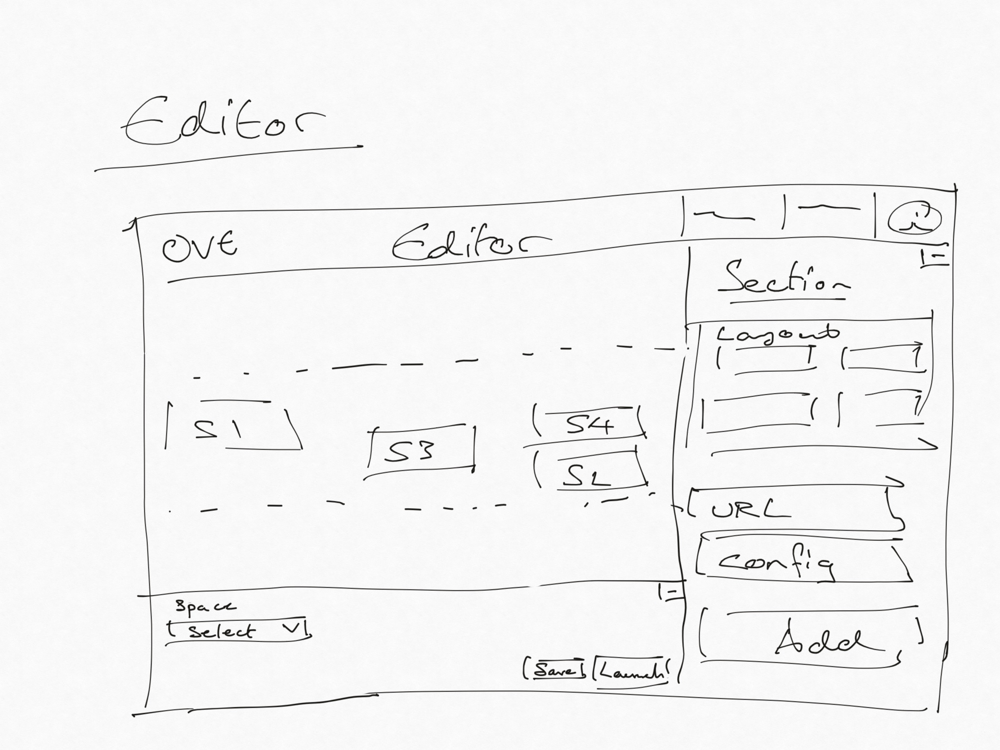
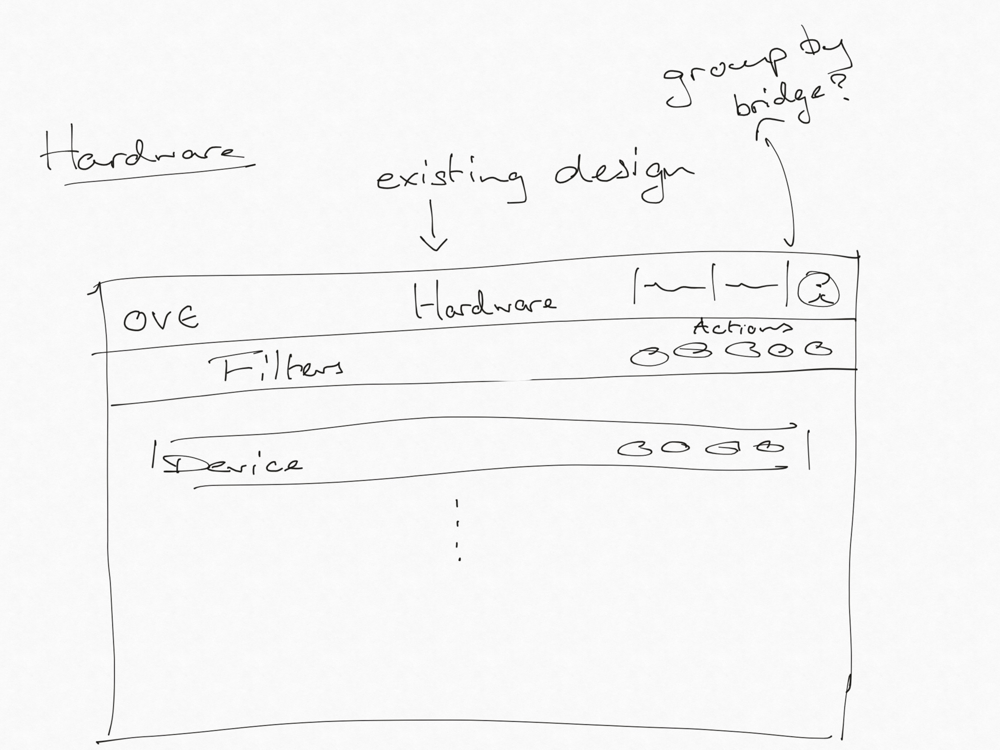
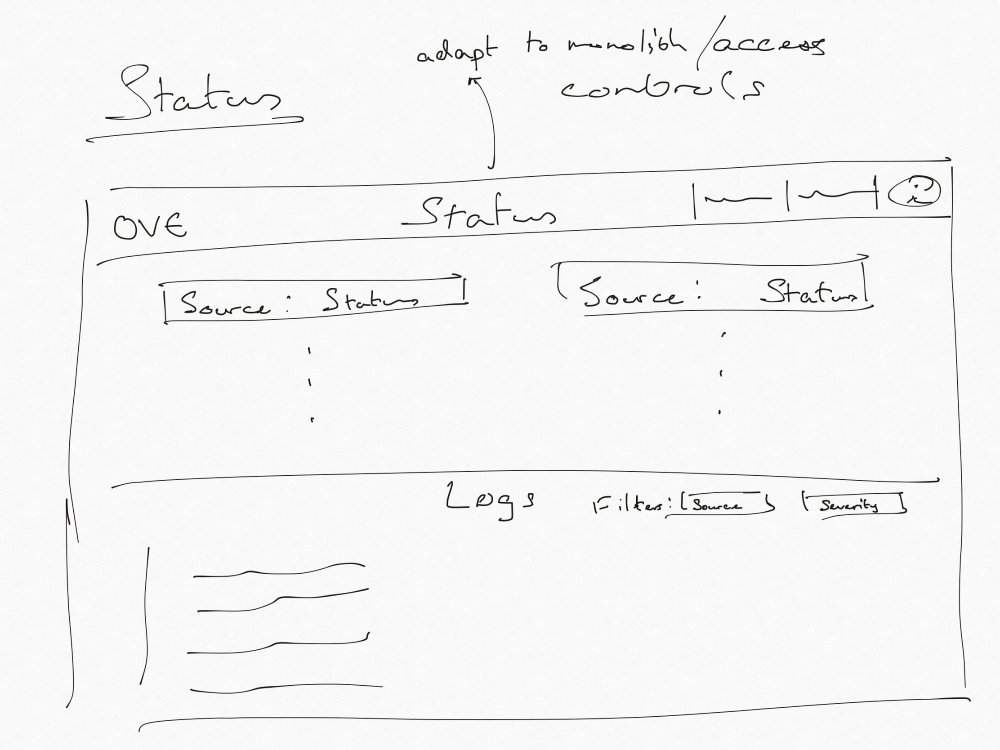
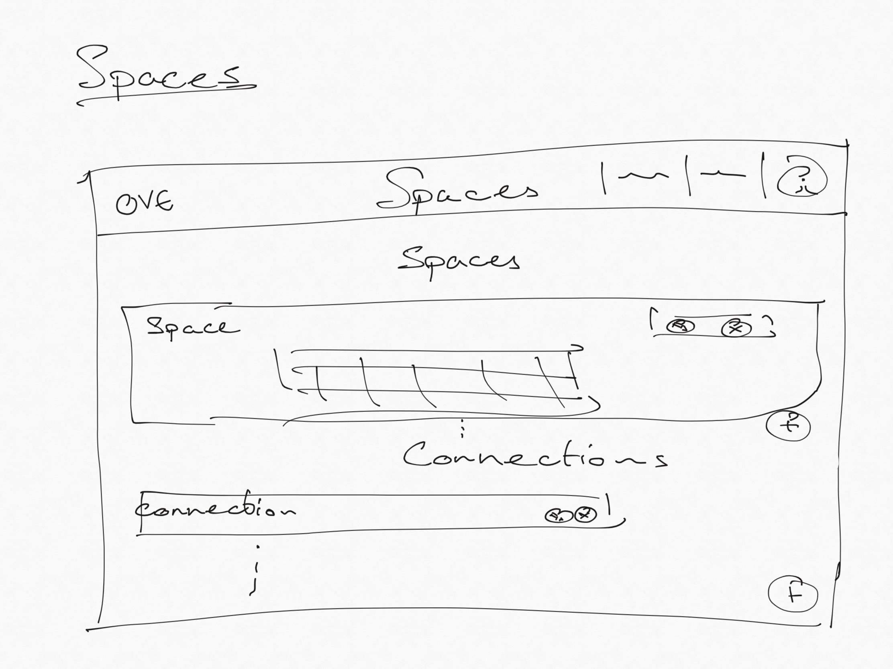
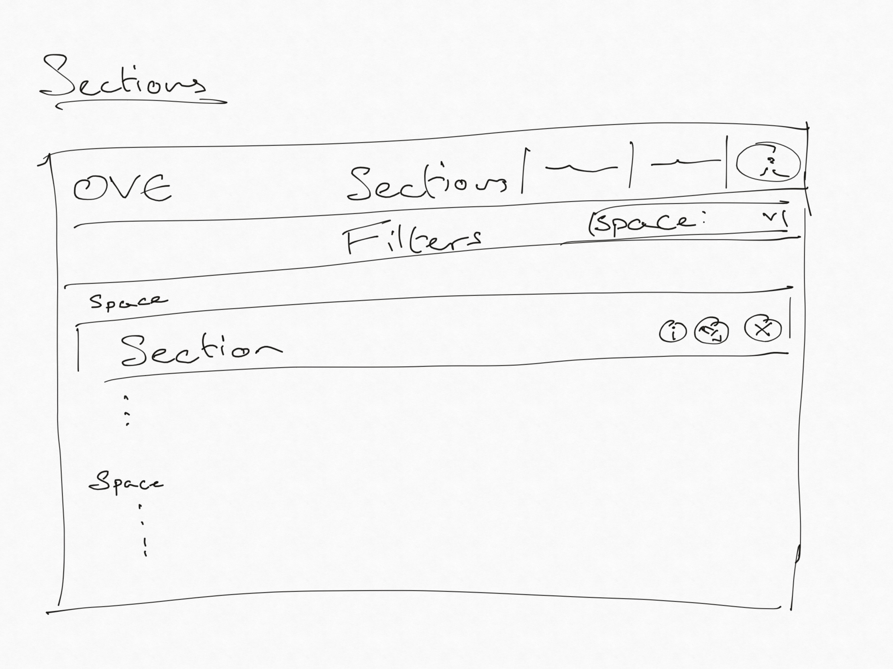
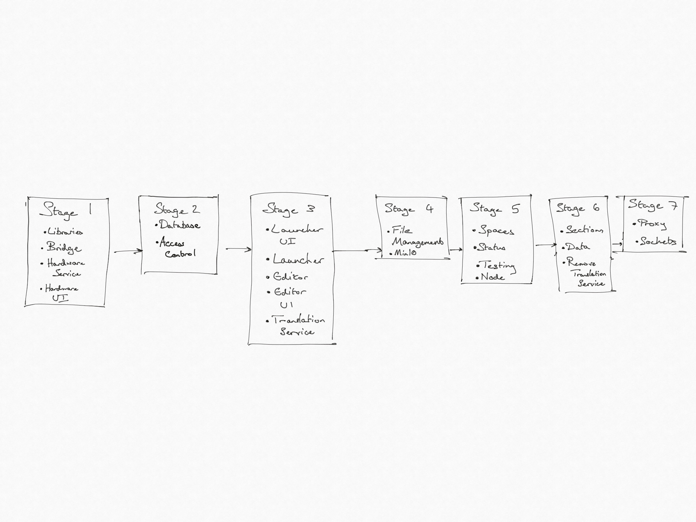

# OVE Rebuild

## Users

- ### Clients
      Clients use OVE to launch and view existing projects.
- ### Creators
      Creators build visualisations using existing assets.
- ### Developers
      Developers build new custom visualisations.
- ### Admins
      Admins manage the system to ensure consistent performance.
- ### Contributors
      Contributors build new tools and services for OVE through open source contributions.

## System Architecture



### Details

Documentation of system architecture, short descriptions and overview of functionality. Tests are run using Jest for 
unit testing, TestContainers for integration testing and Playwright for visual regression testing.

#### Node

Server for handling the control of hardware nodes. Can manage Linux and Windows systems.
Implements basic hardware controls, as well as browser management and screenshotting.
Will be installed on device, using Electron or Playwright to control browsers.

#### Bridge

Client to both hardware devices and the hardware controller. Source of truth for hardware information.
Sits behind network, connecting to devices locally and able to connect via web sockets to the controller remotely.

#### OVE

OVE is split into three main modules, Core, System and Visualisation.

Core comprises the current core functionality, split into Spaces and Sections, as well as the Apps, remodelled 
to a multi-modal Data subcomponent. Sections are to be made space and data type independent with an optional
configuration component for data type specific functionality.

System is the component used by admins for monitoring system health and availability.
It will be composed of Hardware, Status and Testing subcomponents.

Visualisation is the client facing Launcher and Editor tools for creating new projects and
launching and editing existing ones.

#### Services

Additional functionality separate to the core remit of OVE. Initially comprising an HTTP proxy,
socket server and S3 file manager.

### Models

#### Spaces.

```json
{
  "id": 0,
  "w": 0,
  "h": 0,
  "x": 0,
  "y": 0,
  "devices": []
}
```

#### Sections.

```json
{
  "id": 0,
  "space": "",
  "url": "",
  "cache": false,
  "geometry": {
    "w": 0,
    "h": 0,
    "x": 0,
    "y": 0
  },
  "config": {},
  "groups": []
}
```

#### Connections.

```json
{
  "primary": {
  },
  "secondary": [
    {
    }
  ],
  "isInitialized": false,
  "map": [
    {
      "primary": 0,
      "secondary": 0
    }
  ],
  "id": 0
}
```

#### Projects.

```json
{
  "metadata": {
    "authors": "",
    "controller": "",
    "description": "",
    "name": "",
    "thumbnail": ""
  },
  "sections": [],
  "spaces": [],
  "connections": []
}
```

#### Hardware.

```json
{
  "id": "",
  "description": "",
  "ip": "",
  "port": 0,
  "protocol": "",
  "mac": "",
  "tags": []
}
```

#### Messages.

```json
{
  "application": "",
  "section": 0,
  "client": "",
  "message": {}
}
```

### APIs

#### Controller.

```yaml
paths:
  /reboot:
    post:
      summary: "Reboots machine"
  /shutdown:
    post:
      summary: "Shuts down machine"
  /status:
    get:
      summary: "Machine status"
  /info:
    get:
      summary: "Information about machine"
  /processes:
    get:
      summary: "Processes running on machine"
  /browser:
    get:
      summary: "Browser status"
    post:
      summary: "Open browser"
    delete:
      summary: "Kill browser"
  /execute:
    post:
      summary: "Remote code execution"
  /screenshot:
    get:
      summary: "Captures screenshot of device"
```

#### Bridge.

```yaml
paths:
  /devices:
    get:
      summary: "Gets all device configurations"
  /device/{id}:
    get:
      summary: "Gets the configuration of the specified device"
    post:
      summary: "Create/update hardware configuration for specified device"
    delete:
      summary: "Deletes the hardware configuration for the specific device"
  /devices/{tag}/reboot:
    post:
      summary: "Reboots all devices for tag"
  /devices/{tag}/shutdown:
    post:
      summary: "Shuts down all devices for tag"
  /devices/{tag}/start:
    post:
      summary: "Starts all devices for tag"
  /device/{id}/reboot:
    post:
      summary: "Reboots the specified device"
  /device/{id}/shutdown:
    post:
      summary: "Shuts down the specified device"
  /device/{id}/start:
    post:
      summary: "Starts the specified device"
  /device/{id}/execute:
    post:
      summary: "Remotely executed code on device"
  /device/{id}/screenshot:
    post:
      summary: "Capture screenshot of device"
  /device/{id}/status:
    get:
      summary: "Get status of device"
  /device/{id}/info:
    get:
      summary: "Get device information"
  /device/{id}/processes:
    get:
      summary: "Get processes running on device"
  /device/{id}/browser:
    get:
      summary: "Get status of browser on device"
    post:
      summary: "Open browser on device"
    delete:
      summary: "Kill browser on device"
```

#### OVE

```yaml
paths:
  /logs:
    get:
      summary: "Provides logs for service"
  /status:
    get:
      summary: "Status of service"
```

##### Projects.

```yaml
paths:
  /projects:
    get:
      summary: "All saved projects"
  /project/{id}:
    get:
      summary: "Project configuration"
    post:
      summary: "Create/update project configuration"
    delete:
      summary: "Delete project configuration"
  /project/{id}/load:
    post:
      summary: "Load project configuration"
  /layout/render:
    post:
      summary: "Render layout configuration to fixed pixel values"
```

##### Spaces.

```yaml
paths:
  /spaces:
    get:
      summary: "Get all spaces in Spaces.json"
    post:
      summary: "Overwrite Spaces.json"
  /space:
    post:
      summary: "Create/update space configuration"
  /connections:
    get:
      summary: "All connections"
    delete:
      summary: "Delete all connections"
  /connections/{space}:
    get:
      summary: "All connections for space"
    delete:
      summary: "Deletes all connections for space"
  /connection/{primary}/{secondary}:
    get:
      summary: "Connection between spaces"
    post:
      summary: "Creates a connection between the spaces"
    delete:
      summary: "Deletes the connection"
  /connection/test/{primary}/{secondary}:
    get:
      summary: "Tests ability to connect the spaces"
```

##### Sections.

```yaml
paths:
  /sections:
    get:
      summary: "Reads details of sections"
    delete:
      summary: "Deletes sections"
  /sections/refresh:
    post:
      summary: "Refreshes sections"
  /sections/transform:
    post:
      summary: "Transforms sections"
  /sections/{id}:
    get:
      summary: "Reads details of a section"
    post:
      summary: "Updates a section"
    delete:
      summary: "Deletes a section"
  /sections/{id}/state:
    get:
      summary: "Gets section's state"
    post:
      summary: "Creates/updates a section's state"
    delete:
      summary: "Resets a section's state to the initial value"
  /sections/{id}/refresh:
    post:
      summary: "Refreshes a section"
  /section:
    post:
      summary: "Creates a section on OVE"
  /groups:
    get:
      summary: "All section groupings"
  /groups/{id}:
    get:
      summary: "Sections in group"
    post:
      summary: "Updates sections in group"
    delete:
      summary: "Deletes group"
  /group:
    post:
      summary: "Group selected sections"
```

##### Data.

```yaml
paths:
  /apps:
    get:
      summary: "Information on data applications"
  /{app}/states:
    get:
      summary: "All existing states for app"
  /{app}/states/{name}:
    get:
      summary: "State configuration"
    post:
      summary: "Create/update state configuration"
    delete:
      summary: "Deletes state"
  /{app}/transform/{instance}/{operation}:
    post:
      summary: "Transform the data via the given operation"
```

##### Status.

```yaml
paths:
  /status:
    get:
      summary: "All component statuses"
  /status/{id}:
    get:
      summary: "Status of specific component"
  /logs:
    get:
      summary: "Get logs of all components"
  /logs/{id}:
    get:
      summary: "Get logs of specific component"
```

##### Hardware.

```yaml
paths:
  /devices:
    get:
      summary: "Gets all device configurations"
  /device/{id}:
    get:
      summary: "Gets the configuration of the specified device"
    post:
      summary: "Create/update hardware configuration for specified device"
    delete:
      summary: "Deletes the hardware configuration for the specific device"
  /devices/{tag}/reboot:
    post:
      summary: "Reboots all devices for tag"
  /devices/{tag}/shutdown:
    post:
      summary: "Shuts down all devices for tag"
  /devices/{tag}/start:
    post:
      summary: "Starts all devices for tag"
  /device/{id}/reboot:
    post:
      summary: "Reboots the specified device"
  /device/{id}/shutdown:
    post:
      summary: "Shuts down the specified device"
  /device/{id}/start:
    post:
      summary: "Starts the specified device"
  /device/{id}/execute:
    post:
      summary: "Remotely executed code on device"
  /device/{id}/screenshot:
    post:
      summary: "Capture screenshot of device"
  /device/{id}/status:
    get:
      summary: "Get status of device"
  /device/{id}/info:
    get:
      summary: "Get device information"
  /device/{id}/processes:
    get:
      summary: "Get processes running on device"
  /device/{id}/browser:
    get:
      summary: "Get status of browser on device"
    post:
      summary: "Open browser on device"
    delete:
      summary: "Kill browser on device"
```

### User Journeys

- #### Launch existing project
      Used by clients to view existing visualisations.
      Should not require any access controls for public visualisations, access controls required for private projects.
      Provides hardware control for managing hardware during visualisation.
      Login -> Home/Launcher
- #### View Spaces and Sections
      Used by clients and creators to access controllers and see space dimensions
      Login -> Home/Launcher -> Spaces/Sections
- #### Connect Spaces
      Used by clients or admins to connect spaces, either locally or remotely
      Login -> Home/Launcher -> Spaces (-> fab) Connection config
- #### Create new project
      Used by creators to build new visualisation.
      Should not require access controls unless saving.
      Abstract canvas.
      Preview in space.
      Relative and fixed layouts.
      Login -> Home/Launcher (-> click fab) Editor (-> click save/launch)
- #### Edit existing project
      Used by creators to update existing visualisations.
      Requires access controls.
      Same interface as for creation.
      Login -> Home/Launcher (-> click details, then edit) Editor (-> click save/launch)
- #### Manage system hardware
      Used by admins.
      Lists available devices.
      Requires access controls.
      Push commands to devices via connected bridges.
      Login -> Home/Launcher -> Hardware
- #### Check service status
      Used by admins and developers?
      System logs and component statuses, with logs filterables by severity and source.
      Login -> Home/Launcher -> Status
- #### Sign out
      Any screen (-> click user icon, then logout) -> Login
- #### Build custom visualisation
      Developer journey, relies on socket and logging libraries.
- #### Contribute to/Build OVE
      Build system, add components, make pull requests.

### Wireframes















### Existing Issues

### Decisions

- Location of Spaces.json file and associated API endpoints
  - Move to Spaces component
- How to transfer testing files, whether to have control client connect to file management service or receive and send through HTTP
  - Connect to file management service
- Whether to include hardware logging in status or include status in hardware
  - Include in hardware
- Whether to include bridge to screens and projectors and control clients, given large amount of shared functionality
  - Include
- Whether to separate file management service into constituent services
  - No
- Whether to architect as services with APIs and separate UI components or architect service into backend of UI component
  - Separate UI component
- Whether to add hardware control to launcher
  - Yes
- What access controls to give non-admins to system management
  - None
- Whether to convert relative sections on creation or at display time
  - Use translation service until core service is rebuilt, then at display time
- Whether to make sections space agnostic
  - Yes
- Whether to keep source of truth for hardware on Core or Bridge
  - Bridge
- Whether to have multiple bridges
  - Allowed, not used in DSI deployment
- Whether to fold testing into status component
  - Testing component pushed to later date
- How to connect Node to file management service
  - Subsumed by above
- Whether to expose shutdown functionality on launcher
  - Yes, but space specific
- Whether to bypass authentication if no auth server provided
  - Yes
- What project metadata to keep
  - All
- Whether to support developing HTML controller in Editor
  - Needs further development

## Endpoint Structure

```yaml
paths:
  /: Home Page/Launcher?
  /api: All API endpoints
  /spaces: Spaces
  /projects/editor: Project Editor
  /projects/launcher: Project Launcher
  /system/status: System Status
  /system/hardware: System Hardware
  /system/testing: System Testing
```

## Time frame


